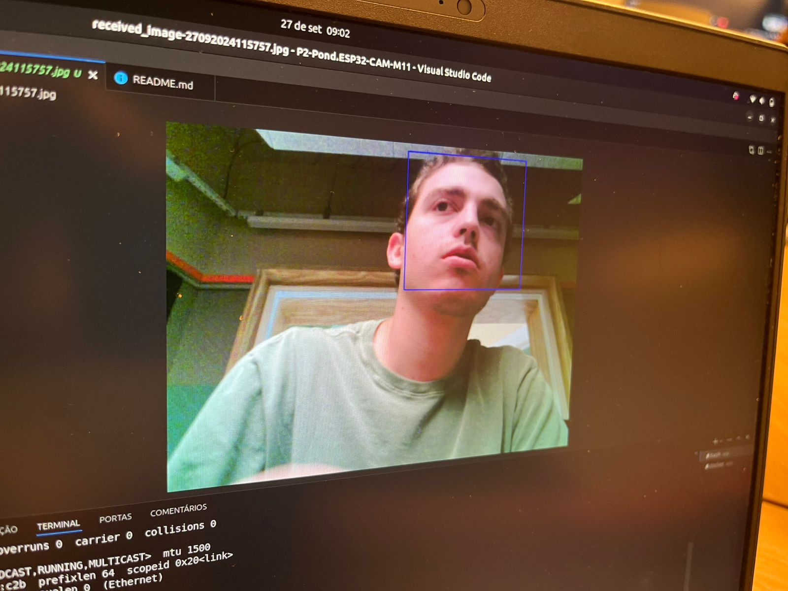

# Descrição 
Este backend foi criado para receber imagens enviadas por um dispositivo IoT (ESP32-CAM), realizar a detecção de rostos com o uso do OpenCV, e salvar localmente a imagem processada com os rostos destacados. O sistema foi desenvolvido com FastAPI e OpenCV, e utiliza Docker para simplificar a execução em ambientes padronizados.

# Dependencias
```
fastapi
uvicorn
opencv-python
```

# Execução do projeto

Comando para executar o servidor
```
uvicorn app.main:app --reload
```


# Compravante do funcionamento

